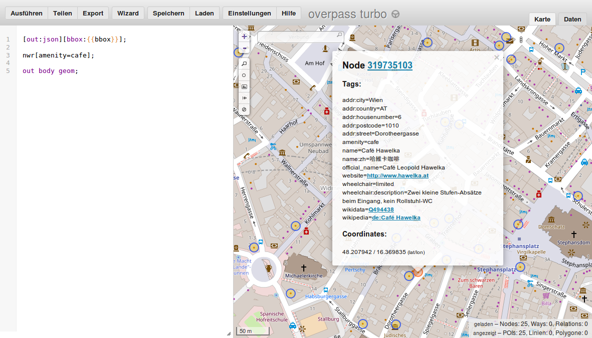

<!-- footer: CC-BY-SA 4.0 https://github.com/plepe/2019-03-20-presentation-overpass -->
# Overpass API
## Die Schnittstelle zur OpenStreetMap


Für das "Vienna Geo Meetup" am 20.3.2019

Stephan Bösch-Plepelits - skunk@openstreetmap.at - plepe.at

Social media:
- Twitter: twitter.com/plepe
- Mastodon: https://en.osm.town/@plepe
- Jabber: skunk@jabber.at

---
<!-- page_number: true -->

## Was ist die Overpass API?
Eine effiziente Datenbank um Daten aus der OpenStreetMap auszulesen.

-> https://wiki.openstreetmap.org/wiki/Overpass_API

---

##  Overpass Query (gekürzt)
```
[out:json][bbox:48.21,16.37,48.22,16.38];
node[amenity=cafe];
out body geom;
```

```json
{ "version": 0.6,
  "generator": "Overpass API 0.7.55",
  "elements": [
    { "type": "node", "id": 319735103,
      "lat": 48.2079420, "lon": 16.3698350,
      "tags": {
        "amenity": "cafe",
        "name": "Café Hawelka",
        "name:zh": "哈維卡咖啡",
        "website": "http://www.hawelka.at",
        "wikipedia": "de:Café Hawelka"
      }
    }, ...
  ]
}
```

---

## Overpass Turbo
Ein Frontend für Overpass API, zu finden auf
https://overpass-turbo.eu




---

## Overpass Turbo - Features

* "Wizard" für das schnelle Erstellen von Abfragen
* "Export" in verschiedene Formate: GeoJSON, GPX, KML, OSM
* "Teilen" Permalinks erstellen
* Daten-Ansicht

---

## Overpass QL (1/5)

Overpass Query Language. Jede Query besteht aus mehreren Teilen:

1. Einstellungen
2. Selektierung
3. Ausgabe

Nach einer Ausgabe kann wieder eine weitere Query folgen.

Im folgenden werden nur die wichtigsten Konstrukte erklärt, eine vollständige Anleitung gibt es auf https://wiki.openstreetmap.org/wiki/Overpass_API/Overpass_QL

---

## Overpass QL (2/5) - Einstellungen

```c
[out:json] vs. [out:xml] vs. [out:csv] // Format
[bbox:48.2,16.2,48.4,16.4] // Region (default: Welt)
[date:"2018-12-24T19:00:00Z"] // Historische Daten
[diff:] and [adiff:] // Vergleich (verwende: [out:xml])
```

---

## Overpass QL (3/5) - Selektierung
Typ:
```c
node, way, relation, nwr, area
```
Selektiere Tags:
```c
nwr[amenity=cafe]; // Tag hat Wert
nwr[amenity]; // Tag hat irgendeinen Wert
nwr[amenity~"^(bar|cafe)$"]; // Regular Expression
nwr[~"name"~"straße$"]; // Regular Expression
```
Selektiere nach ID:
```c
node(1234);
node(id:1234,1235);
```

---

## Overpass QL (4/5) - Ausgabe
```c
out;
```
Detailgrad:
* `ids`: nur IDs
* `meta`: inkludiere Meta-Daten (timestamp, user, ...)

Geo-Informationen:
* `geom`: Volle Geometrie, inkl. Members
* `bb`: Nur bounding box
* `center`: Nur Centroid

---

## Overpass QL (5/5) - Weitere Konstrukte

Union:
```c
( node[amenity=cafe]; node[amenity=bar]; );
```
Members:
```c
way[highway]; out; >; out;
```

---

## Happy mapping!

Questions?
